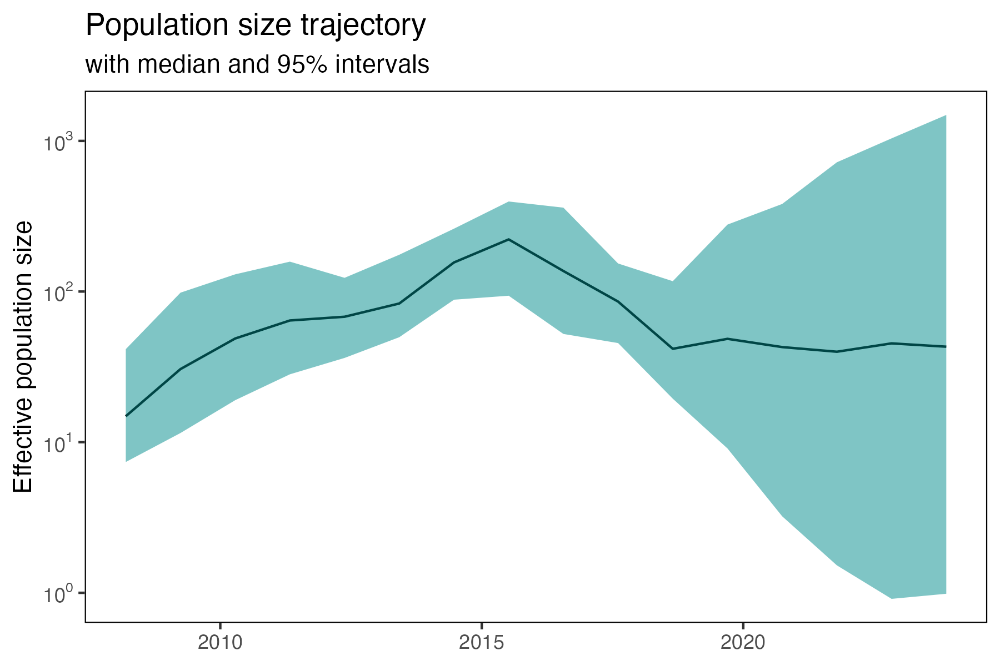

# skygrid

[](https://pypi.org/project/beast-skygrid)
[](https://pypi.org/project/beast-skygrid)



## Installation

```console
pip install beast-skygrid
```

## License

`skygrid` is distributed under the terms of the [MIT](https://spdx.org/licenses/MIT.html) license.
